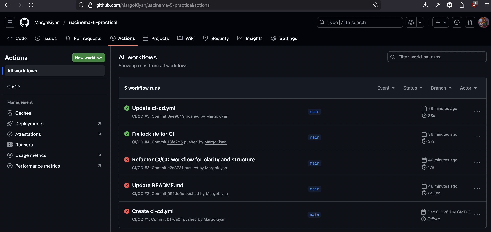
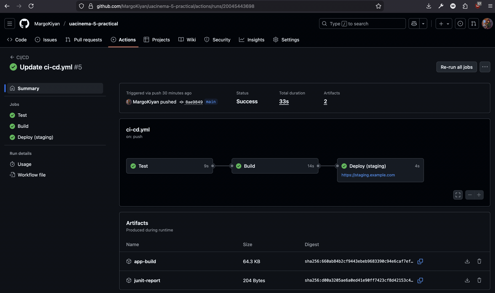
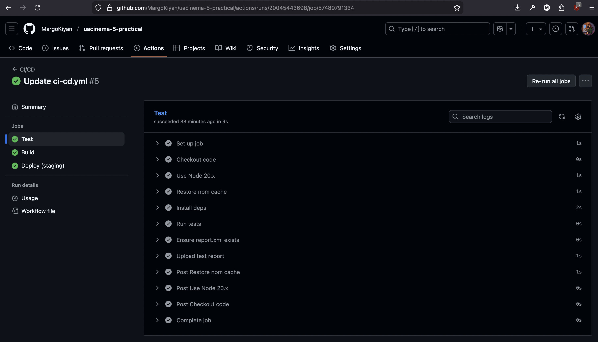
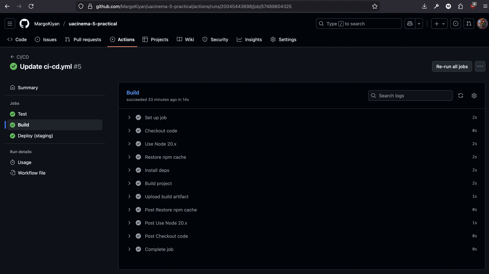
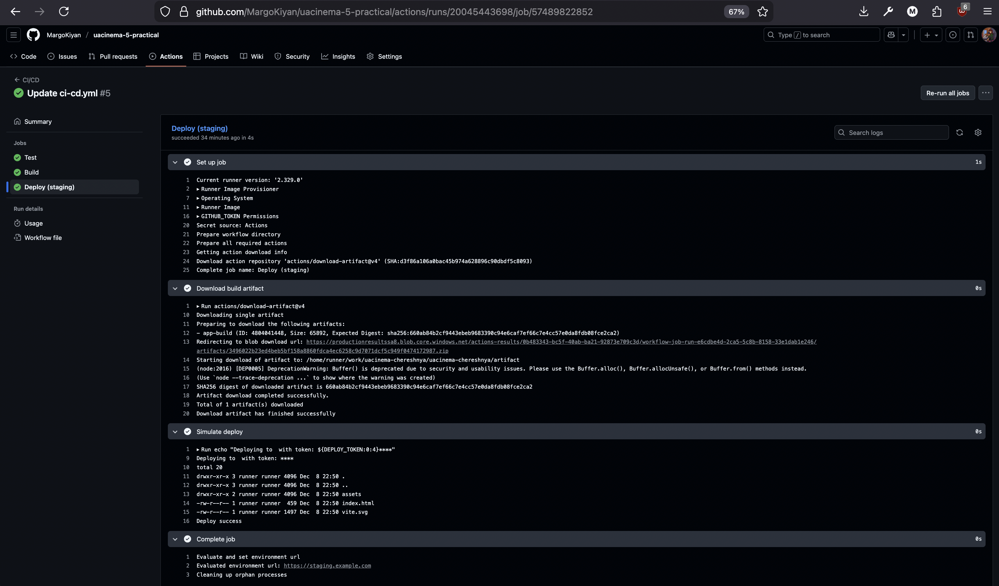
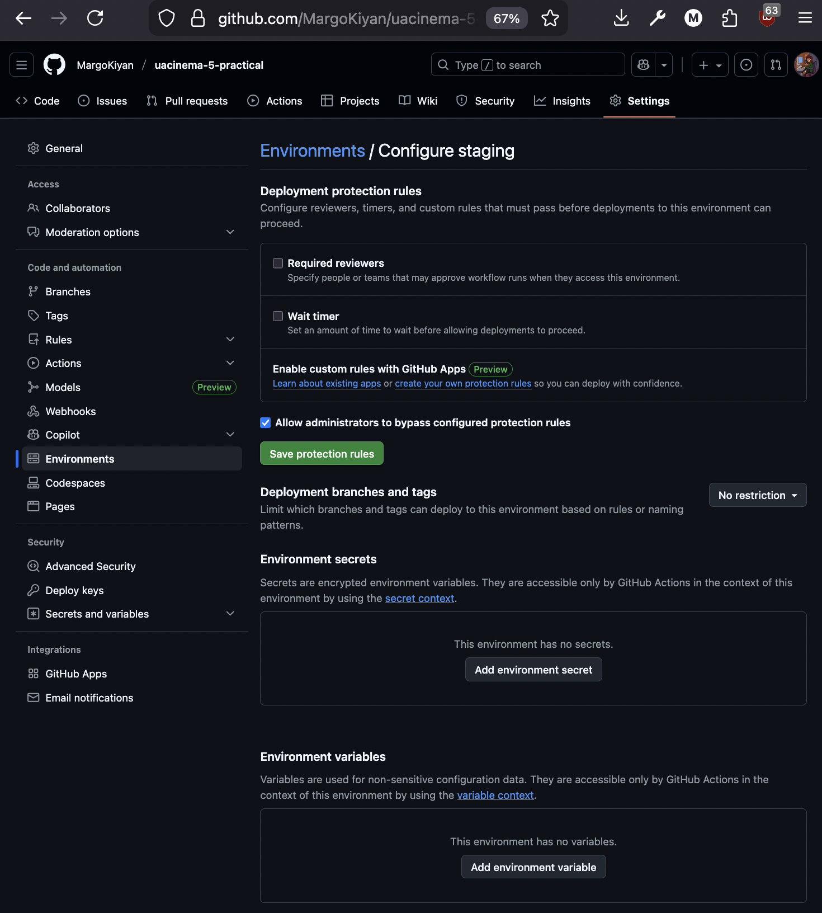
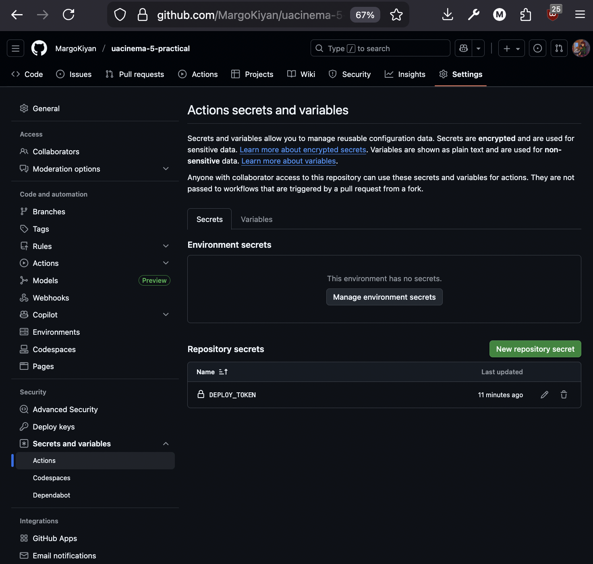

# Практичне завдання 5 — GitHub Actions (CI/CD)

## Виконали: ПД-21 "Черешня" – Киян Маргарита, Солдатов Андрій

Нижче наведено результати виконання практичного завдання з налаштування CI/CD для проєкту **uacinema** за допомогою GitHub Actions.

---

## 1. Створення репозиторію та першого workflow

Скріншот репозиторію з першим комітом і вкладкою **Actions / Workflows**.

---

## 2. Успішний запуск workflow (green job) та артефакт

Скріншот успішного запуску (green job) та відображення артефакту у Run.

---

## 3. Job тестування (test)

Скріншот виконання job **test** (запуск тестів у пайплайні).

---

## 4. Job збірки (build) та артефакти

Скріншот job **build** та списку артефактів зі зібраним застосунком.

---

## 5. Job деплою (deploy) та середовище staging

Скріншот job **deploy** та панелі **Environments** з оточенням `staging`.

---

## 6. Environments, Secrets та Variables

Скріншот налаштувань середовища `staging` (environments), а також розділу **Secrets and variables**.

